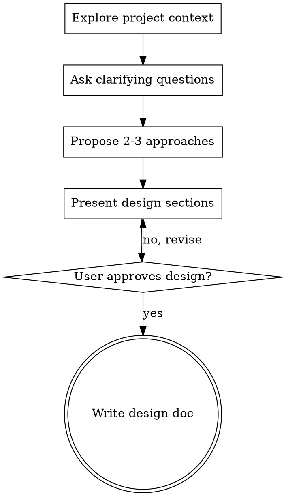

# Brainstorming Ideas Into Designs

<IRON-LAW>
ONE QUESTION AT A TIME. PREFER MULTIPLE CHOICE.
</IRON-LAW>

## Overview

Help turn ideas into fully formed designs and specs through natural collaborative dialogue.

Start by understanding the current project context, then ask questions one at a time to refine the idea. Once you understand what you're building, present the design and get user approval.

<HARD-GATE>
Do NOT invoke any implementation skill, write any code, scaffold any project, or take any implementation action until you have presented a design and the user has approved it. This applies to EVERY project regardless of perceived simplicity.
</HARD-GATE>

## Three Phases

### Phase 1: Understanding
- Check project context (files, docs, recent state)
- Ask clarifying questions **one at a time**
- Focus on: purpose, constraints, success criteria
- Use multiple choice from `references/question-patterns.md` when possible

### Phase 2: Exploring
- Propose 2-3 approaches with trade-offs
- Lead with your recommended option and explain why
- Present options conversationally

### Phase 3: Presenting
- Present the design in sections (see `references/design-sections.md`)
- Scale each section to its complexity: a few sentences if straightforward, up to 200-300 words if nuanced
- Ask after each section whether it looks right so far
- Cover: architecture, components, data flow, error handling, testing

## Anti-Patterns

| Anti-Pattern | Why It's Bad | Do This Instead |
|-------------|-------------|-----------------|
| Question dump | Overwhelms user, gets shallow answers | One question per message |
| Open-ended only | Harder to answer, slower | Multiple choice when possible |
| Assume requirements | Wrong assumptions waste work | Ask, verify, confirm |
| Skip to solution | Misses constraints, wrong approach | Understand before proposing |
| Over-design | Complexity for complexity's sake | YAGNI ruthlessly |

## Checklist

You MUST create a task for each of these items and complete them in order:

1. **Explore project context** — check files, docs, recent state
2. **Ask clarifying questions** — one at a time, understand purpose/constraints/success criteria
3. **Propose 2-3 approaches** — with trade-offs and your recommendation
4. **Present design** — in sections scaled to complexity, get user approval after each section
5. **Write design doc** — save to `.claude/plans/YYYY-MM-DD-<topic>-design.md` and commit

## Process Flow

**The terminal state is the committed design doc.** Do NOT invoke any implementation skill or write any code during brainstorming.

## References

- `references/question-patterns.md` — Multiple choice templates for scope, priority, constraint, trade-off questions
- `references/design-sections.md` — Android/Kotlin section templates

## Key Principles

- **One question at a time** — Don't overwhelm with multiple questions
- **Multiple choice preferred** — Easier to answer than open-ended when possible
- **YAGNI ruthlessly** — Remove unnecessary features from all designs
- **Explore alternatives** — Always propose 2-3 approaches before settling
- **Incremental validation** — Present design, get approval before moving on
- **Be flexible** — Go back and clarify when something doesn't make sense
